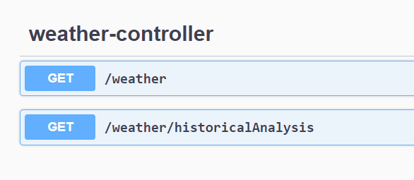

## WeatherApp

### Description

RESTful web service that returns the weather data determined by the IP of a request originator by handling GET requests to path “weather”. Upon receiving a request, the service performs a geolocation search using [Keycdn](https://tools.keycdn.com/). After receiving the geolocation data service
uses [open-meteo](https://open-meteo.com/) to determine current weather conditions using the coordinates of the IP.

### Response examples

<details>
<summary>
getWeather response example
</summary>
<p>

### Response body example:

```
{
  "id": 16,
  "ip": "19.199.123.156",
  "time": "2023-05-19T14:07:14.8033464",
  "latitude": 37.71453,
  "longitude": -97.77939,
  "temperature": 17.8,
  "windSpeed": 19.2,
  "windDirection": 50,
  "weatherCode": 55
}
```

### Schema example value:

```
{
  "id": 0,
  "ip": "19.199.123.156",
  "time": "1023-13-32T11:10:51.820Z",
  "latitude": 0,
  "longitude": 0,
  "temperature": -100.0,
  "windSpeed": 20000.0,
  "windDirection": 0,
  "weatherCode": 500
}
```

</p>
</details>

<details>
<summary>
getHistoricalAnalysis response example
</summary>
<p>

### Response body example:

```
{
  "averageTemperature": 17.8,
  "minTemperature": 17.8,
  "maxTemperature": 17.8,
  "averageWindSpeed": 19.2,
  "averageWindDirection": 50,
  "averageWeatherCode": 55
}
```

### Schema example value:

```
{
  "averageTemperature": 0,
  "minTemperature": 0,
  "maxTemperature": 0,
  "averageWindSpeed": 0,
  "averageWindDirection": 0,
  "averageWeatherCode": 0
}
```

</p>
</details>

### Setup

Clone this repository.

### Usage

First, go to the directory where you previously cloned this project and run the following command to build the app.
```
gradle build
```
Before running the app, you will need to create a Docker container. Run those commands in the command prompt:
```
docker pull postgres

docker run --name weather -p 5432:5432 -e POSTGRES_USER=postgres -e POSTGRES_PASSWORD=postgres -d postgres
```
After that run the app via the command:
```
gradlew bootRun
```


After running the app, the endpoint description will be available in [Swagger](http://localhost:8080/swagger-ui/index.html)


## Tests

Run the unit tests using the command  `./gradlew test`
